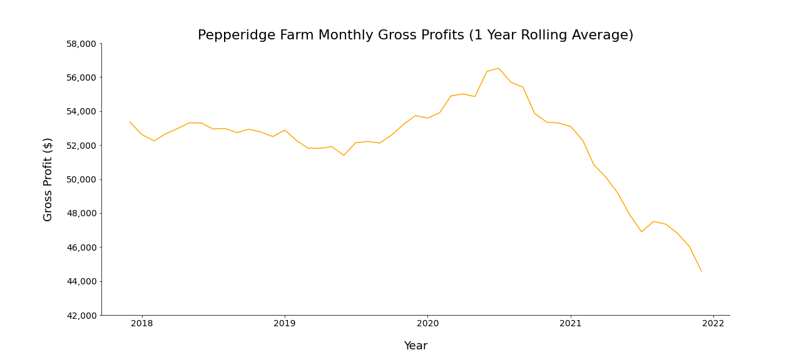
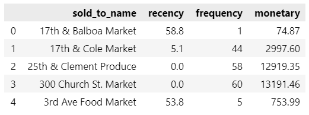
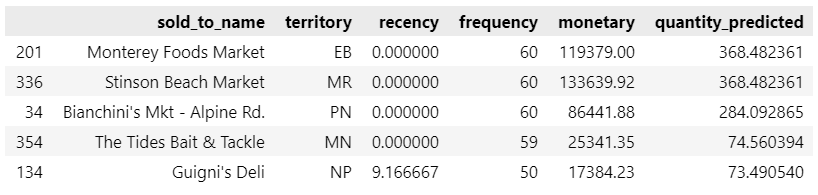

# Problem Statement
The Pepperidge Farm franchise has been having supply issues. Less product to distribute has caused the profits of Dale Cox Distributing to decrease.

How can these lost profits be recovered?

 

*After a slight increase in gross profits during the start of COVID, profits have steadily decreased.*

 

# Data

## Size
### Products
352733 rows x 14 columns
### Profits
30501 rows x 12 columns

## Source
The company's database.

## Target
Quantity of a product

## Data Dictionaries

    
products_clean.csv

|Feature|Type|Dataset|Description|
|-------|----|-------|-----------|
|territory|object|products_clean.csv|Geographic area, mostly counties|
|ar_div|object|products_clean.csv|Product line|
|customer_num|object|products_clean.csv|Identification number of a store|	
|sold_to_name|object|products_clean.csv|The name of a store|
|item_num|object|products_clean.csv|Identification number of an item|
|item_description|object|products_clean.csv|The description of an item|
|item_type|object|products_clean.csv|The type of item|
|unit_of_measure|object|products_clean.csv|The unit of |measurement for an item|
|weight|object|products_clean.csv|The weight of an item|
|standard_price|float|products_clean.csv|The price the company sells an item for|
|quantity|float|products_clean.csv|The quantity a store ordered of the given product|
|price|float|products_clean.csv|Total price (standard price x quantity)|
|year|int|products_clean.csv|The year of the transaction|
|month|int|products_clean.csv|The month of the transaction|
|date|datetime|products_clean.csv|The date of the transaction|

    
profits_clean.csv

|Feature|Type|Dataset|Description|
|-------|----|-------|-----------|
|ar_div|object|profits_clean.csv|Product line code|
|customer_num|object|profits_clean.csv|Identification number of a store|	
|sold_to_name|object|profits_clean.csv|The name of a store|
|product_line|object|profits_clean.csv|The product line (PF or DCD)|
|year|int|profits_clean.csv|The year of the transaction|
|month|int|profits_clean.csv|The month of the transaction|
|quantity|float|profits_clean.csv|The quantity of products ordered|
|ext_price|float|profits_clean.csv|The extended price|
|ext_cost|float|profits_clean.csv|The extended cost|
|gross_profit|float|profits_clean.csv|The gross profits from product ordered|
|territory|object|profits_clean.csv|Geographic area, mostly counties|

 

# Model
I created a profile for each store using RFM. I also had monthly data for the stores that ordered each product. I knew I wanted to target the stores that weren’t ordering these products.

 

*Here is an example of some stores after performing RFM analysis and computing the values.*

 

I decided I would treat this as a regression problem and try and predict how much product a store would order in a month.
I created and tested 5 different types of models. I ended up using a XGBoost Regressor for my production model because it performed the best.

The features of the model were recency, frequency, and monetary value of a store’s orders. 
The target, or thing I was trying to predict, was the quantity of product a store would order in a month.

I trained the model on the stores that ordered the product. 
Once the model was trained, I then would take the stores that were not ordering this product with their RFM information and predict how much those stores would order.

Once I had my predictions, I could then sort the stores based on the predicted quantity ordered.
This would list the stores in order from best to worst target when determining which stores to attempt to push more products to.

This process was repeated for each of the 7 product labels that Dale Cox Distributing has control over, as well as some top selling products.

 

|Product|Baseline RMSE|RMSE|
|-------|-------------|----|
|La Morenita|168|86|
|Baker's Delight|34|22|
|SF Flatbread|23|16|
|Casa Linda|15|13|
|Asti|15|12|
|Longitute|14|10|
|Bertolino|11|8|

 

I judged my models performance on the RMSE, or root mean squared error. The baseline that I was trying to beat would be predicting the average quantity in the dataset for every order. 
Each of my models beat the baseline, but nothing spectacular. The real value of my model was how it acted as a recommender. 
I fed it the information about the stores, and it would give me those predictions on how much product a store would order in a month.

 

 

# Deliverables
I have created an Excel workbook with multiple sheets. Each sheet is for a product. On each sheet, I have the information from my predictions. The stores are ordered from best to worst stores to target for distribution of a product.

I have also created a Tableau Dashboard for the company to allow them to further explore the data themselves.

# Recommendations
By following my recommendations, I believe the profits lost from the Pepperidge Farm supply issues can be recovered.

My first recommendation would be some upgrades for Dale Cox Distributing.
Although I was able to retrieve the data needed, it was not easy. Upgrading the database, systems, and software would allow for more access to the data for better analysis. With more analysis, I believe more profits can be generated. My second recommendation is to push the 7 controlled labels into more stores. I have provided the stores to target for each product.

# Limitations and Next Steps
I have more plans on how I can continue to help the company.
There is a lot more data to explore that I believe I can provide valuable analysis on.
I want to specifically look into the locations of stores and the delivery routes to weigh the cost of distributing to stores based on how much they order.

